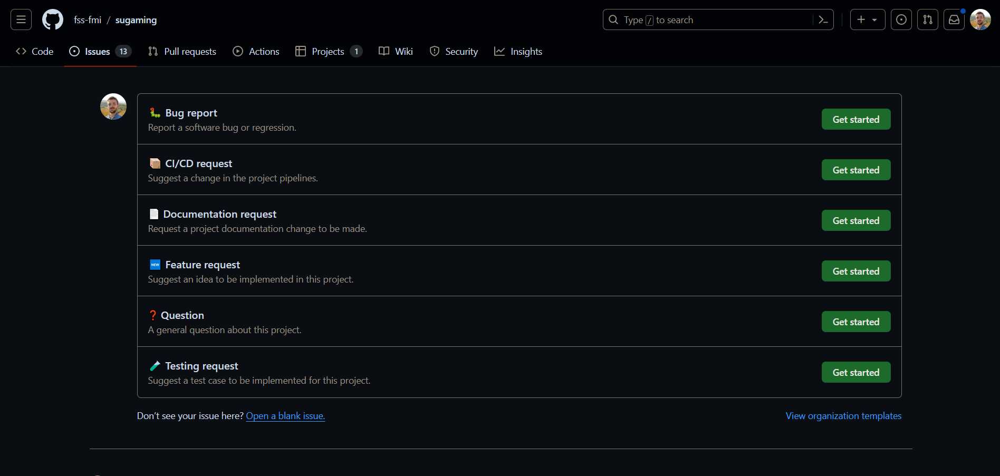
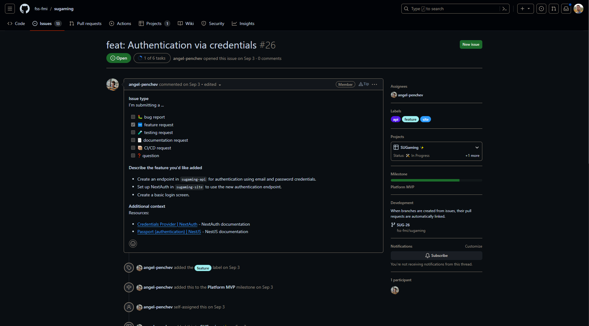
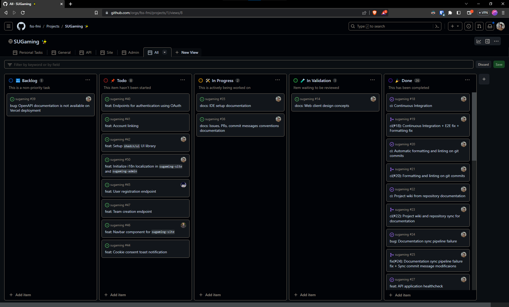
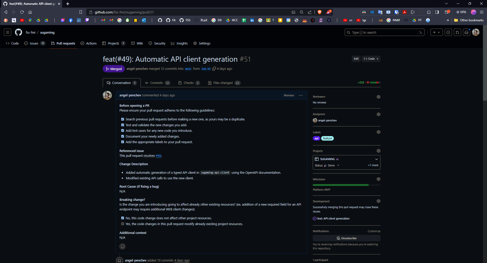
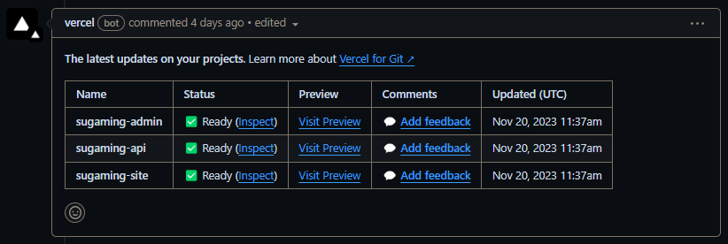
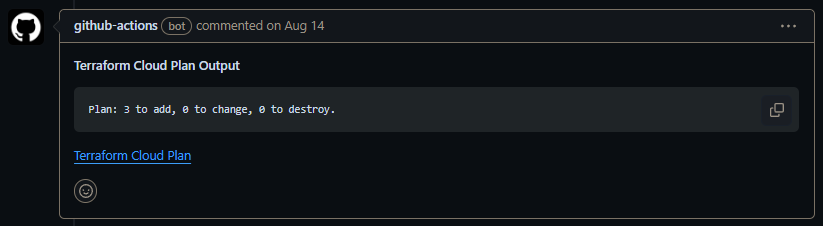
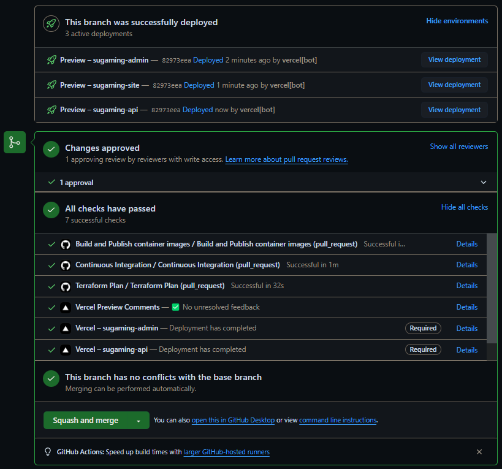

# From a Task to a Feature - Workflow Description

This manual should walk you through the entire process of creating a task (issue), working on it, submitting a pull request, merging and deploying it. The guide will also outline several conventions that you should stick to in the process.

### Table of contents

1. [Issues](#-issues)
2. [Project Boards](#-project-boards)
3. [Git Branches](#-git-branches)
4. [Commit Conventions](#-commit-conventions)
5. [Pull Requests (PRs)](#-pull-requests-prs)
6. [Preview and Production deployments](#-preview-and-production-deployments)

---

## 🎟️ Issues

Issues are a feature of GitHub that allows tracking, discussion, and prioritization of tasks, features, bug fixes, and other issues related to software projects. In this project it is used for task tracking, work assignment and team communication.

To view all the open issues for SUGAMING - [go to this page](https://github.com/fss-fmi/sugaming/issues).

To create an issue, select the `New issues` button and choose an appropriate template to the task you are assigning. In case you need to modify the issue templates, they are stored as markdown files in `.github/ISSUE_TEMPLATE`.



Whenever creating an issue, make sure to stick to the template and give as much context as you currently have. Also, ensure that you have assigned the appropriate labels, project, milestone and assignee(s) in the right-side panel. It's not a problem if a request doesn't initially have an assignee - it can be assigned later.



An open issue is considered as a task to be completed - so whenever a task is completed, make sure to close the issue, whether that will be via a comment or a [pull request](#-pull-requests-prs).

## 📊 Project Boards

GitHub has a project board feature called "GitHub Projects". It can be used to organize all the project issues and their statuses.

To view the project board for SUGAMING - [go to this page](https://github.com/orgs/fss-fmi/projects/1).

Whenever you open the project board, it will have the following 6 tabs:

- `Personal Tasks` - Tasks assigned to you
- `General` - General task, not related to the API, the site or the admin panel
- `API` - Tasks regarding the API backend
- `Site` - Tasks regarding the front-end client
- `Admin` - Tasks regarding the admin panel
- `All` - All project tasks

Work is sorted in 5 columns: `🔙 Backlog`, `📌 Todo`, `🛠 In Progress`, `🧪 In Validation`, and `🎉 Done`.



You can use the board to organize your personal work or overview tasks across the project.

## 🌿 Git Branches

Whenever you are working on a task, which requires changes to the project source code, you should create a git branch and make your changes in it. You can associate a GitHub issue with a branch by going to the issue page, and selecting the `Create a branch` button under `Development` in the right-hand side of the page.

When creating a branch, you should specify a name for it. I recommend you including the GitHub issue number in the branch name. Personally, I name my branches `SUG-<ticket number>` (`SUG` is shortened from `SUGAMING`), but you can go with whatever suits you (including the default suggested by GitHub).

Before starting work on a feature, **always remember to `git checkout` your branch locally**. Direct pushes to the `main` branch are restricted.

https://github.com/fss-fmi/sugaming/assets/26301867/a65d1e9d-1381-4fe0-945f-b053aef13cf5

## 🔬 Commit Conventions

To keep the project repository tidy and well maintained, a few code checks are made when you make a git commit. Those check can be put into 2 categories:

- **Commit message checks**

  - Each commit message should consist of a `header`, a `body` and a `footer`. The `header` has a special format that includes a `type`, a `scope` and a `subject`:

    ```
    <type>(<scope>): <subject>
    <BLANK LINE>
    <body>
    <BLANK LINE>
    <footer>
    ```

  - The commit message `header` should start with one of the following `type` keywords:

    - `feat` - when introducing a new feature to the project.
    - `fix` - when addressing a bug or error.
    - `build` - when you are introducing changes related to the build system or external dependencies. It could include configuration changes or updates to build scripts.
    - `chore` - when performing routine tasks, maintenance, or minor adjustments that are not related to the application's logic.
    - `ci` - when changing the Continuous Integration (CI) configuration or any other automated workflow.
    - `docs` - when making documentation-related changes, such as updating README files or adding comments.
    - `perf` - when you introduce changes that improve the performance of the application.
    - `refactor` - when you are restructuring code without changing its external behavior.
    - `revert` - when reverting a previous commit. The commit being reverted should be referenced.
    - `style` - when making changes that do not affect the meaning of the code, such as formatting, white-space, or code style adjustments.
    - `test` - when you are adding or modifying tests.

  - The `scope` in the header is optional and can be used to specify the module, component, or area of the project that the commit affects.

  - The `subject` in the header should be a concise and clear description of the changes introduced by the commit.

  - The `body` is optional (but highly recommended) and can provide additional details about the changes, providing context or explaining the reasoning behind the commit.

  - The `footer` is optional and can be used to reference issue tracker IDs or include breaking change notices.

  - A more detailed documentation about `Conventional Commits` could be found [here](https://www.conventionalcommits.org/en/v1.0.0/).

  - **Important:** If the commit message does not comply with this ruleset, the commit is terminated.

- **Contents check**

  - **Formatting using `prettier`** - Upon committing, a file formatting check is performed using `prettier`. If formatting error are found, `prettier` tries to resolve them. In case any errors cannot be resolved, the commit process is stopped.

  - **Linting using `eslint`** - All `.ts` and `.tsx` files are linted using `eslint` on commit. If the linting process finds errors, `eslint` tries to fix them and if it fails to do so - the commit is terminated.

  - **Prisma formatting** - Whenever committing, the `prisma/scheme.prisma` schema file is checked and formatted.

  - **Terraform formatting** - If the `terraform` command is available on the current machine, `.tf` files in the `terraform/` directory are check and formatted.

---

The checks are performed using the [husky](https://www.npmjs.com/package/husky) tool. This means that you should have installed the project dependencies beforehand. For an installation manual, please refer to the [Development Setup section in the Developer Onboarding guide](./Developer-Onboarding.md#-project-development-setup).

Most of the aforementioned content checks can be displayed right in your IDE, while you are developing. For reference on how to set those checks up, refer to the [IDE Setup section in the Developer Onboarding guide](./Developer-Onboarding.md#-ide-setup).

## ⏩ Pull Requests (PRs)

Whenever a task is completed, the changes from the task's git branch should be merged into the `main` branch. This is done via Pull Request (PRs).

To create a new PR, go to the `Pull requests` tab on GitHub and click `New pull request` (or click [here](https://github.com/fss-fmi/sugaming/compare)). Then select the branch you want to merge and click `Create pull request`.

You will be presented with a PR template - make sure to stick to it and give as much information about your changes as you can. Also, ensure that you have assigned the appropriate labels, project, milestone and reviewers in the right-side panel.

The PR title must be in the following format:

```
<type>(<issue number>): <subject>
```

where:

- `type` should usually the same as in the issue title, should be one of the following: `feat`, `fix`, `build`, `chore`, `ci`, `docs`, `perf`, `refactor`, `revert`, `style`, `test`.
- `issue number` should be the number of the issue the PR is resolving (e.g. `#26`).
- `subject` should be a concise and clear description of the changes introduced by the commit.

Several good examples of good PR titles are `feat(#26): Credentials authentication`, `fix(#24): Documentation sync pipeline failure fix`, `docs(#36): Workflow description documentation`, etc.



---

Each PR deploys preview versions of the `sugaming-api`, `sugaming-site` and `sugaming-admin` apps to Vercel. These previews can be inspected by following the links in the comment left by the Vercel bot in the pull request.



**Note:** To inspect the builds, you need to be logged in the organization Vercel account. Refer to [the secrets repo](https://github.com/fss-fmi/secrets/blob/main/credentials.md) for account credentials.

---

In addition, if the PR has infrastructure changes (changes in the `terraform` directory), a Terraform Plan will be created and linked as a comment.



**Note:** To inspect the Terraform Cloud run, you need to be logged in the organization Vercel account. Refer to [the secrets repo](https://github.com/fss-fmi/secrets/blob/main/credentials.md) for account credentials.

---

Before merging the PR, it should pass 2 checks:

- **It must be reviewed and tested** by at least 1 team member.
- **It must pass all automated checks.** The automated checks include:
  - `Vercel – sugaming-api` - Preview deployment of `sugaming-api` has completed successfully.
  - `Vercel – sugaming-site` - Preview deployment of `sugaming-site` has completed successfully.
  - `Vercel – sugaming-admin` - Preview deployment of `sugaming-admin` has completed successfully.
  - `Terraform Plan` has created an infrastructure change plan, if there are changes present in `terraform/`.
  - `Continuous Integration` - The entire project builds successfully, passes formatting and linting checks, passes unit and E2E tests.
  - `Build and Publish` - Container images of `sugaming-api`, `sugaming-site` and `sugaming-admin` have been built for and published to the [GitHub Packages Hub](https://github.com/orgs/fss-fmi/packages) and to the [Docker Hub](https://hub.docker.com/u/fssfmi).



After all that is complete, you can `Squash and merge` the PR into the `main` branch. 🥳

## 🚀 Preview and Production Deployments
